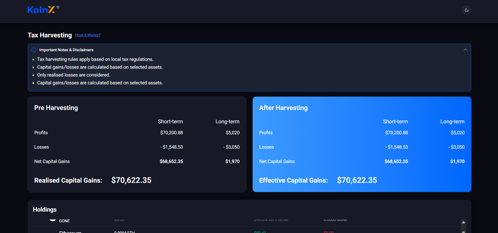
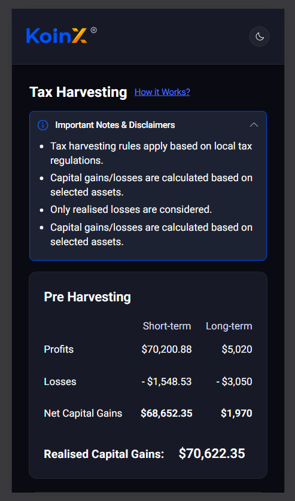

# 📊 Tax Loss Harvesting Dashboard

A responsive frontend application that simulates a **crypto tax loss harvesting tool**, built using **Next.js, Tailwind CSS, and shadcn/ui**.

---

## 🚀 Features

*  Display user holdings with detailed breakdown
*  Pre-harvesting vs Post-harvesting comparison
*  Select holdings to simulate tax loss harvesting
*  Automatic gain/loss recalculation
*  Sorting (Short-term gains ascending/descending)
*  View All / Show Less functionality
*  Mobile responsive design (with horizontal scroll)
*  Clean UI based on Figma design
*  Dark mode support

---

## 🛠️ Tech Stack

* **Next.js (App Router)**
* **React**
* **Tailwind CSS**
* **shadcn/ui**
* **TypeScript**

---

## ⚙️ Setup Instructions

### 1. Clone the repository

```bash
git clone https://github.com/saurabh-xd/koinx
cd your-repo-name
```

---

### 2. Install dependencies

```bash
npm install
```

---

### 3. Run development server

```bash
npm run dev
```

---

### 4. Open in browser

```bash
http://localhost:3000
```

---






---

## ⚡ Key Functionality

* Selecting a holding updates:

  * Short-term profits/losses
  * Long-term profits/losses
  * Overall capital gains

* If post-harvesting gain is lower than pre-harvesting:

  * A savings message is displayed

---

## 🎯 Notes

* Focus was on **clean UI + correct logic implementation**
* Followed component-based architecture
* Avoided over-engineering (no Redux, simple state management)


---
